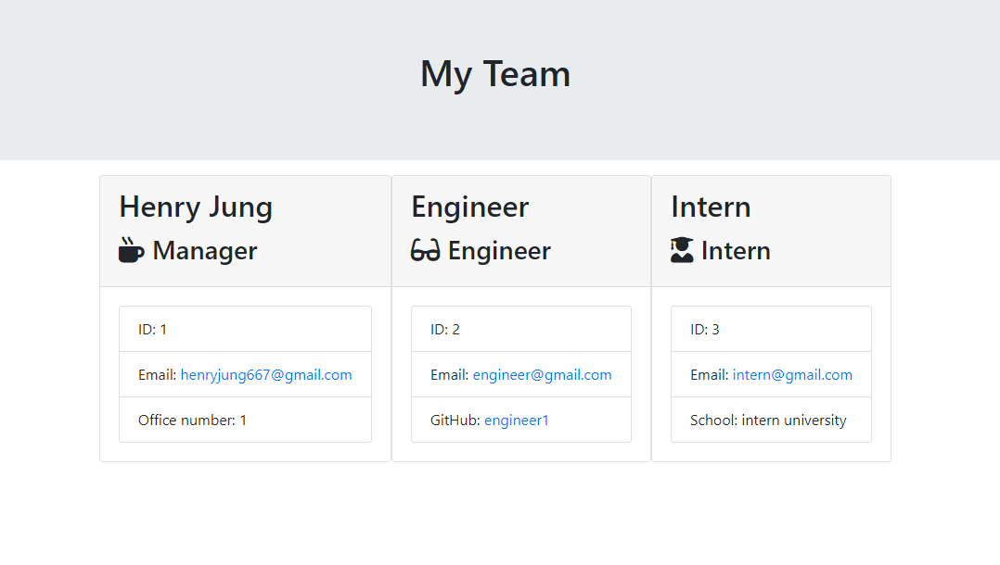

# 10_Employee_Summary

## Table of contents

* [Description](#Description)
* [UserStory](#User Story)
* [Instructions](#Instructions)
* [Links](#Links)
* [Screenshots](#Screenshots)
* [Demo](#Demo)
* [Credits](#Credits)

## Description

This is a software engineering team generator that uses the command line to render a team through inquirer prompts and populates on an html page styled with bootstrap, you can add a Manager, Engineer, and Intern, each having a unique prompt, employee id, and email. 

## User Story

As a manager
I want to generate a webpage that displays my team's basic info
so that I have quick access to emails and GitHub profiles

## Instructions

enter node app.js into the command line and follow the prompts, once completed go into the output folder and open the team.html file and you will see your generated team.

# Links

Github repo: https://github.com/Henryrjung/10_Employee_Summary

## Screenshots

# Demo

* https://drive.google.com/file/d/1q_le2jTK2nMjh3iJAffeIMoWLnhHLYCJ/view

## Credits
* https://www.npmjs.com/package/inquirer
* https://stackoverflow.com/questions/56412516/conditional-prompt-rendering-in-inquirer
* https://www.digitalocean.com/community/tutorials/nodejs-interactive-command-line-prompts
* https://www.youtube.com/watch?v=D-XXOlN1MeE 
* Class-repo

